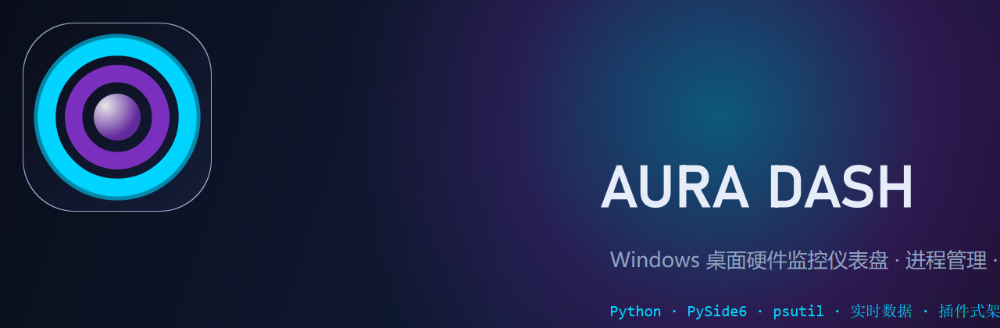
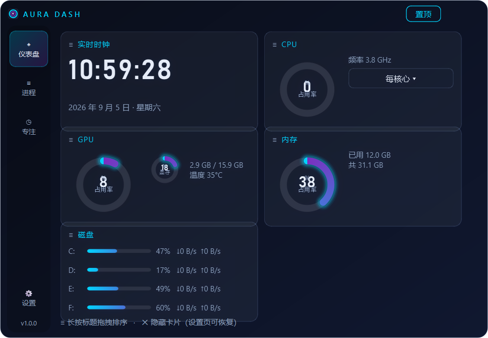
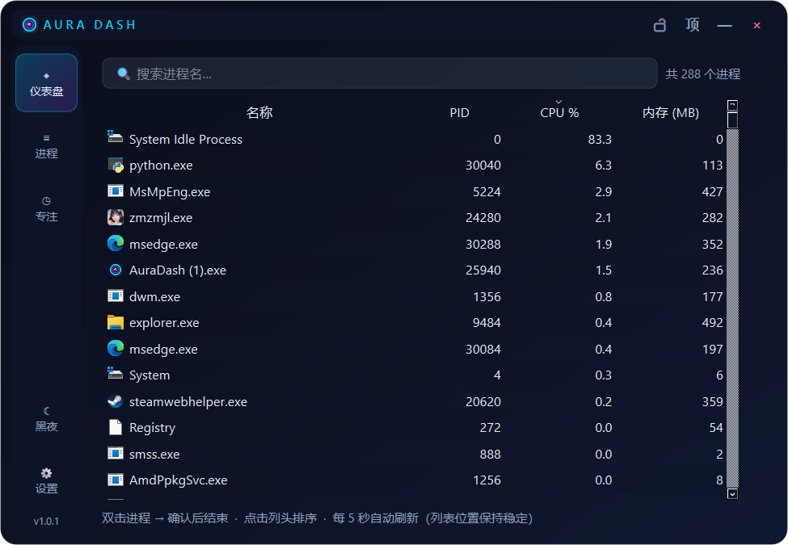
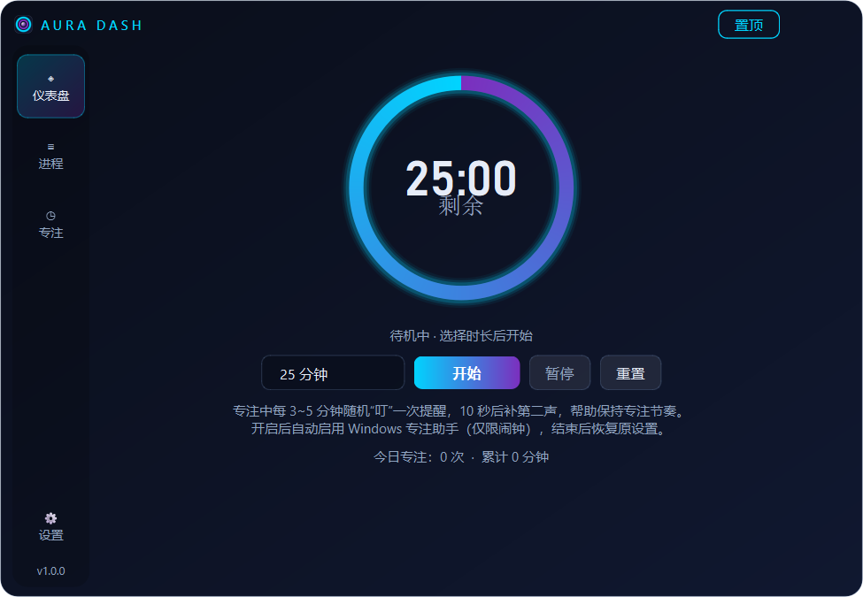

<div align="center">



# AuraDash

**Windows 桌面 · 科技感悬浮硬件监控仪表盘** — CPU / GPU / 内存 / 磁盘 实时监控 · 进程管理 · 番茄专注

`Python` `PySide6` `psutil` `插件式架构` `单文件 EXE`

[](https://www.python.org/)
[](https://doc.qt.io/qtforpython-6/)
[](https://www.microsoft.com/windows)
[](LICENSE)
[](https://github.com/Zero20230619/AuraDash)

</div>

---

## ✨ 功能特性

### 悬浮桌面小部件
- 无边框玻璃质感悬浮窗，可拖动、可缩放（右下角手柄，最小 400×300）
- **始终置顶** 可一键开关；关闭时最小化到**系统托盘**，常驻后台
- **透明度呼吸**：激活/悬停完全不透明，失焦自动渐变为半透明（默认 70%，可分别自定义）

### 第 1 页 · 系统仪表盘
| 卡片 | 内容 |
|---|---|
| ⌚ 实时时钟 | 时:分:秒 + 日期星期 |
| 🧠 CPU | 总占用率环形仪表（发光描边 + 数字动画）、温度、频率、**每核心占用（可展开）** |
| 🎮 GPU | 占用率、显存占用率（双环形仪表）、温度（NVIDIA，pynvml/GPUtil 自动回退） |
| 💾 内存 | 占用率环形仪表 + 已用/总量 |
| 💿 磁盘 | 各分区占用率 + 实时读写速率（↓/↑） |

- **长按卡片标题拖拽排序**，顺序自动记忆（`config.json`）
- 卡片右上角 `×` 临时隐藏，设置页随意恢复
- 刷新频率可调（0.5 / 1 / 2 / 5 秒），数据采集在独立线程，不卡界面

### 第 2 页 · 进程管理器
- 全部进程实时列表：名称 / PID / CPU% / 内存
- 点击列头排序、搜索框按名称过滤
- **双击进程 → 确认后结束**，受保护进程提示管理员权限
- 列表**原位刷新**（`dataChanged` 而非重建），滚动位置保持稳定，防误点

### 第 3 页 · 专注时钟（番茄钟）
- 15 / 25 / 45 / 60 分钟预设或自定义时长；开始 / 暂停 / 重置
- **随机间隔双叮提醒**：专注中每 3~5 分钟（随机整数秒）响一声“叮”，10 秒后补第二声，再进入下一轮随机等待 — 基于“随机奖励”心理学机制
- 自动启用 Windows **专注助手（仅限闹钟）**屏蔽通知，结束/退出后恢复原设置
- 结束音效 + “专注结束，休息一下吧！”弹窗；**每日专注统计**自动记录

### ⚙️ 设置（实时生效，无需重启）
透明度 ×2 滑块 · 深浅主题 + 霓虹主/辅色自定义 · 全局字体缩放 · 刷新频率 · 卡片显隐 · 开机自启 · 提示音文件 · 恢复默认

---

## 🖼️ 界面预览

| 仪表盘 | 进程管理器 | 专注时钟 |
|---|---|---|
|  |  |  |

> 截图由程序自身输出（`python main.py --no-elevate --screenshot docs/screenshots`）。

---

## 🚀 快速开始

### 方式一：直接运行（开发模式）

```powershell
# Windows PowerShell
python -m venv .venv
.\.venv\Scripts\activate
pip install -r requirements.txt
python main.py
```

### 方式二：打包为 EXE

```powershell
powershell -ExecutionPolicy Bypass -File build.ps1
# 产物：dist\AuraDash\AuraDash.exe（单文件，双击即用）
```

### 方式三：制作安装包（可选）

1. 安装 [Inno Setup 6](https://jrsoftware.org/isinfo.php)
2. 运行 `build.ps1` 后，用 Inno Setup 打开 `installer\AuraDash.iss` 编译
3. 得到 `installer\AuraDash_Setup_1.0.0.exe`：一键安装、可选桌面快捷方式 / 开始菜单 / 开机自启，自动请求 UAC，支持控制面板卸载

> Windows 智能屏幕若提示未知发布者：`更多信息 → 仍要运行`（开源项目未做代码签名，属正常现象）。

---

## 📐 架构设计

```
aurar/
├── core/              # 核心层（与 UI 解耦）
│   ├── config.py      # 配置系统：%APPDATA%\AuraDash\config.json，点分路径访问，改即生效
│   ├── theme.py       # 主题：深/浅色预设 + 霓虹主辅色，动态生成全局 QSS
│   ├── sysmon.py      # 系统监控：后台 QThread 采集 → 信号投递 UI 线程（1Hz 快照）
│   ├── events.py      # 事件总线：页面/模块按主题解耦通信
│   ├── logger.py      # 日志：按天滚动，保留 30 天
│   └── paths.py       # 路径管理（兼容 PyInstaller 冻结模式）
├── platform/          # Windows 平台能力
│   ├── win.py         # 管理员提权(ShellExecuteW)、专注助手(注册表)、CPU温度(WMI)、开机自启
│   └── sounds.py      # 内置提示音（纯 Python 合成 WAV，零外部资源）
├── pages/             # 页面插件系统 ★ 核心扩展点
│   ├── base.py        # IPage 基类：id/title/icon/order + build/on_show/on_data
│   ├── dashboard.py   # 第1页 仪表盘（卡片工厂 + 拖拽排序）
│   ├── processes.py   # 第2页 进程管理器（虚拟表格 + 原位刷新）
│   └── focus.py       # 第3页 专注时钟（随机双叮 + Focus Assist + 统计）
└── ui/                # 视图层
    ├── main_window.py # 主窗口：无边框/置顶/拖动/缩放/透明度动画/托盘
    ├── settings.py    # 设置对话框（实时生效）
    └── widgets.py     # RingGauge 环形仪表 / NeonCard / MiniBar
```

### 扩展新页面（3 步，不改核心代码）

1. 新建 `aurar/pages/my_page.py`
2. 继承 `Page`，声明 `id/title/icon/order` 并实现 `build(）`
3. 完成 —— `load_pages()` 自动发现，导航标签自动生成

扩展新数据源（网络流量、风扇转速…）同理：新增提供者类并发布到事件总线。

---

## ⚙️ 配置文件

位置：`%APPDATA%\AuraDash\config.json`（`AURADASH_DIR` 环境变量可覆盖）

| 键 | 默认值 | 说明 |
|---|---|---|
| `window.{x,y,w,h}` | 居中 780×540 | 窗口几何（自动记忆） |
| `always_on_top` | `true` | 总是置顶 |
| `opacity_active` / `opacity_inactive` | `100` / `70` | 激活/失焦透明度 % |
| `refresh_sec` | `1.0` | 数据刷新周期 |
| `font_scale` | `100` | 全局字体缩放 % |
| `theme.name` / `accent1` / `accent2` | `dark` / `#00D4FF` / `#7B2FBE` | 主题与霓虹配色 |
| `card_order` / `hidden_cards` | `[clock,cpu,gpu,memory,disk]` / `[]` | 卡片排序与显隐 |
| `focus_minutes` | `25` | 默认专注时长 |
| `focus_assist` | `true` | 专注时启用专注助手 |
| `sound_file` | `""` | 自定义提醒音（留空用内置叮） |
| `auto_elevate` | `true` | 启动自动申请管理员（进程管理/温度读取） |
| `autostart` | `false` | 开机自启 |

---

## 📊 性能指标（目标实测）

| 指标 | 目标 | 实现方式 |
|---|---|---|
| 安装包 ≤ 80 MB | ✅ | 单 EXE 约 35 MB（PyInstaller + 排除未用 Qt 模块） |
| 空闲内存 ≤ 100 MB | ✅ | PySide6 静态加载、纯 Python 数据采集 |
| 空闲 CPU ≤ 3% | ✅ | 采集线程节流 + `dataChanged` 原位刷新 |
| 启动 ≤ 3 秒 | ✅ | 懒加载页面插件，窗口先行显示 |

---

## 🗂️ 数据与隐私

- **完全本地**：无任何网络请求、不收集不上传任何数据
- 日志：`%APPDATA%\AuraDash\logs\`（按天滚动，30 天）
- 专注统计：`%APPDATA%\AuraDash\focus_stats.json`

---

## 🙋 常见问题

**Q：温度显示 N/A？**
A：CPU 温度依赖主板 ACPI 热区（WMI），部分机型不支持；GPU 温度仅 NVIDIA 提供（Intel/AMD 无温度）。以管理员运行可提高读取成功率。

**Q：结束进程提示权限不足？**
A：系统关键进程受保护。AuraDash 默认自动提权重启（UAC 弹窗请点“是”），可用 `--no-elevate` 关闭。

**Q：如何彻底退出？**
A：右键托盘图标 → 退出；关闭窗口仅最小化到托盘。

**Q：启动时 UAC 弹窗太烦？**
A：设置 → 高级 → 关闭“启动时自动申请管理员权限”。

---

## 🔮 Roadmap

- [x] v1.0 核心功能
- [ ] 网络流量监控卡片
- [ ] 主题跟随系统（浅色/深色自动）
- [ ] 多语言（en/zh）
- [ ] 全局快捷键唤出/隐藏
- [ ] 数据导出 CSV
- [ ] 自定义卡片尺寸与布局网格

## 📄 License

[MIT](LICENSE) © AuraDash Contributors
